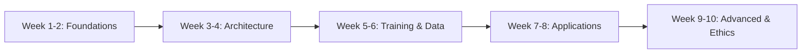

Welcome, student! I'm delighted you want to learn about Large Language Models. As your teacher, I've designed a **progressive, practical course** that takes you from absolute beginner to someone who can understand, use, and even fine-tune LLMs.

This course is structured like a university semester but self-paced. Let's begin.

---

## 📚 Course: LLM Foundations to Application

**Duration:** ~8-10 weeks (self-paced)  
**Prerequisites:** Basic Python, high-school math (matrices, probabilities). Curiosity is mandatory!

---

### 🗺️ Course Roadmap



---

## 📖 Detailed Syllabus

### **Part 1: Foundations (Weeks 1-2)**  
*"What are words to a computer?"*

**Key Concepts:**
- Why language is hard for machines (ambiguity, context, creativity)
- From n-grams to neural networks – the evolution
- **Tokenization**: How text becomes numbers (BPE, WordPiece)
- **Embeddings**: Words as vectors in space – the magic of "king - man + woman = queen"

**Hands-on:**
```python
# Simple embedding visualization with Gensim
import gensim.downloader as api
model = api.load("glove-twitter-25")
print(model.most_similar("teacher"))
```

**Mini-project:** Build a bigram word predictor from scratch.

---

### **Part 2: The Transformer Architecture (Weeks 3-4)**  
*"The paper that changed everything" (Attention is All You Need, 2017)*

**Key Concepts:**
- Why RNNs/LSTMs failed at long-range context
- **Attention mechanism**: "Which previous words matter now?"
- **Self-attention & Multi-head attention**
- **Positional encoding** – because order matters!
- Encoder vs. Decoder – BERT vs. GPT families

**Visual:** *I'll draw the transformer block on the board – query, key, value matrices flowing through.*

**Hands-on:**
```python
# Implement scaled dot-product attention in NumPy (10 lines!)
import numpy as np
def attention(Q, K, V):
    d_k = Q.shape[-1]
    scores = Q @ K.T / np.sqrt(d_k)
    weights = np.exp(scores) / np.sum(np.exp(scores))
    return weights @ V
```

---

### **Part 3: Training LLMs (Weeks 5-6)**  
*"From raw internet text to ChatGPT"*

**Key Concepts:**
- **Three phases:** Pre-training → Fine-tuning → RLHF
- Pre-training: Next-token prediction at scale (terabytes of text)
- Fine-tuning: Supervised learning on instructions
- **RLHF** (Reinforcement Learning from Human Feedback) – why models learn to be helpful, honest, harmless
- Scaling laws: Why bigger + more data = emergent abilities

**Case Study:** Training GPT-3 (175B params) cost ~$4.6M in 2020 – now LLaMA 3 (8B) runs on a laptop!

**Hands-on:** Fine-tune a small GPT-2 model on Shakespeare with Hugging Face.

---

### **Part 4: Working with LLMs (Weeks 7-8)**  
*"Prompt engineering and beyond"*

**Key Concepts:**
- **In-context learning:** Zero-shot, one-shot, few-shot prompting
- **Chain-of-Thought (CoT)** – "Let's think step by step"
- **Retrieval Augmented Generation (RAG)** – giving models live knowledge
- **Quantization** (GPTQ, GGUF) – running 70B models on a gaming GPU
- Tool use & function calling

**Hands-on:** 
- Build a RAG chatbot over your own documents (PDFs, websites)
- Create a prompt that makes the model role-play as Socrates

---

### **Part 5: Advanced & Ethics (Weeks 9-10)**  
*"Limitations, dangers, and the future"*

**Key Concepts:**
- **Hallucinations** – why models make things up confidently
- **Bias & fairness** – what's in the training data comes out
- **Jailbreaking & prompt injection** – security risks
- **Model collapse** – when AI trains on AI-generated data
- **Frontier models** – multimodal (GPT-4V, LLaVA), agents, long-context (1M tokens)

**Discussion:** "If an LLM passes the Turing test, does it understand?"

---

## ✅ Practical Assignments (Pick 3 to master)

1. **Tokenization deep-dive:** Write a BPE tokenizer from scratch
2. **Transformer from scratch:** Implement a mini-GPT in PyTorch (150 lines)
3. **Fine-tuning project:** Adapt Mistral 7B to write in your personal style
4. **RAG system:** Build a research assistant that cites sources
5. **Evaluation benchmark:** Test 5 open models on reasoning tasks (e.g., GSM8K)

---

## 📖 Recommended Resources

**Free & excellent:**
- *"The Illustrated Transformer"* – Jay Alammar (visual intro)
- *Hugging Face NLP Course* – practical, hands-on
- *Andrej Karpathy's "Zero to Hero"* (YouTube series) – builds GPT from scratch
- *LLM University by Cohere* – interactive lessons

**Papers to read (in order):**
1. Attention is All You Need (2017)
2. BERT (2018) & GPT-2 (2019)
3. Chain-of-Thought (2022)
4. Llama 2 paper (2023)

**Tools to know:**
- Hugging Face Transformers
- Ollama / LM Studio (run locally)
- LangChain / LlamaIndex (RAG & agents)
- vLLM (efficient inference)

---

## 🧭 Your First Week Action Plan

1. **Day 1-2:** Read "The Illustrated Word2vec" (then "The Illustrated Transformer")
2. **Day 3-4:** Set up Python environment → `pip install transformers datasets accelerate`
3. **Day 5-7:** Run your first LLM! Load `google/flan-t5-small` and prompt it:

```python
from transformers import pipeline
generator = pipeline("text2text-generation", model="google/flan-t5-small")
print(generator("Explain what an LLM is to a 5-year-old"))
```

---

## 💬 Questions for You, Student

Before we go deeper, tell me:
1. What's your goal? (Build something? Get hired? Satisfy curiosity?)
2. How much Python do you know?
3. Do you have a GPU (even a modest one) or prefer cloud?

Your answers will help me customize the rest of this course for you.

**Now, turn to your neighbor (metaphorically) and introduce yourself. Welcome to the class!** 🎓

