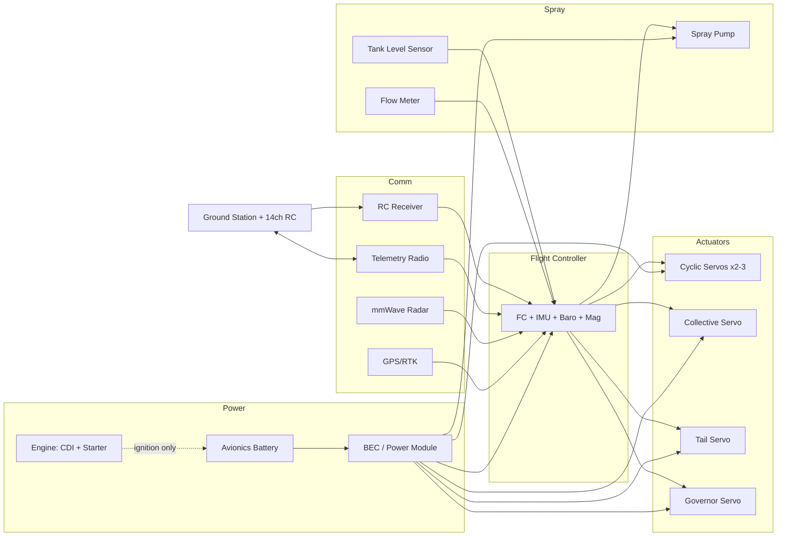

Here is a **concrete workload measurement example** you can reuse. It uses a software engineer, but the same structure works for support, ops, or PM roles.

---

## Scenario

**Person:** Alex (backend engineer)  
**Period:** One week (Mon–Fri)  
**Contracted capacity:** 40 hours/week  
**Effective capacity:** 32 hours/week for individual work  
*(40 hrs minus ~8 hrs for meetings, email, 1:1s, admin)*

---

## Step 1 — List all work items

| ID | Task | Type | Est. effort (h) | Priority | Complexity (1–5) | Due this week? |
|----|------|------|-----------------|----------|------------------|----------------|
| T1 | Fix payment bug | Bug | 6 | P1 (critical) | 4 | Yes |
| T2 | API endpoint for reports | Feature | 12 | P2 (high) | 3 | Yes |
| T3 | Code review (3 PRs) | Review | 4 | P2 | 2 | Yes |
| T4 | Sprint planning + standups | Meeting | 5 | — | 1 | Yes |
| T5 | Onboard new teammate | Support | 3 | P3 | 2 | Yes |
| T6 | Tech debt: refactor auth | Improvement | 8 | P3 | 4 | No (spillover) |
| T7 | Incident on-call (expected) | Ops | 2 | P1 | 3 | Yes |

**Raw total assigned:** 6 + 12 + 4 + 5 + 3 + 8 + 2 = **40 hours**

That already looks like “100% utilized,” but raw hours hide overload because priority, complexity, and context switching aren’t reflected yet.

---

## Step 2 — Add weights (make workload comparable)

### Priority weight

| Priority | Weight |
|----------|--------|
| P1 (critical) | 1.5 |
| P2 (high) | 1.2 |
| P3 (normal) | 1.0 |
| P4 (low) | 0.8 |

### Complexity factor

Use 1.0–1.5 scale (harder work consumes more mental bandwidth):

| Complexity | Factor |
|------------|--------|
| 1 (routine) | 1.0 |
| 2 (moderate) | 1.1 |
| 3 (hard) | 1.2 |
| 4 (very hard) | 1.4 |
| 5 (unknown/risky) | 1.5 |

### Context-switch penalty

Each **distinct work stream** adds overhead:

```text
Context penalty = 1 + (0.05 × (number_of_active_streams − 1))
```

Alex has 6 streams this week (bug, feature, review, meetings, onboarding, on-call) →  
`1 + 0.05 × 5 = 1.25`

---

## Step 3 — Compute weighted workload per task

Formula:

```text
Weighted Load(task) = effort × priority_weight × complexity_factor
```

| Task | Calculation | Weighted load |
|------|-------------|---------------|
| T1 Fix payment bug | 6 × 1.5 × 1.4 | **12.6** |
| T2 API reports | 12 × 1.2 × 1.2 | **17.3** |
| T3 Code review | 4 × 1.2 × 1.1 | **5.3** |
| T4 Meetings | 5 × 1.0 × 1.0 | **5.0** |
| T5 Onboarding | 3 × 1.0 × 1.1 | **3.3** |
| T6 Tech debt | 8 × 1.0 × 1.4 | **11.2** |
| T7 On-call | 2 × 1.5 × 1.2 | **3.6** |

**Sum of weighted load:** 12.6 + 17.3 + 5.3 + 5.0 + 3.3 + 11.2 + 3.6 = **58.3 workload units**

Apply context-switch penalty:

```text
Adjusted workload = 58.3 × 1.25 = 72.9 workload units
```

---

## Step 4 — Convert to utilization

Define a baseline: **1 workload unit ≈ 1 hour of normal (P3, complexity 2) work**.

Alex’s effective capacity = **32 units/week**.

```text
Utilization = Adjusted workload / Effective capacity
            = 72.9 / 32
            = 228%
```

**Interpretation:** Alex is roughly **2.3× overloaded** for the week — even before unexpected work.

---

## Step 5 — Split workload by category (useful for managers)

| Category | Raw hours | Weighted load | % of total |
|----------|-----------|---------------|------------|
| Planned delivery (T1, T2, T6) | 26h | 41.1 | 56% |
| Collaboration (T3, T5) | 7h | 8.6 | 12% |
| Meetings (T4) | 5h | 5.0 | 7% |
| Reactive (T1 partly, T7) | 8h | 16.2 | 22% |
| **Total** | **40h** | **72.9** | **100%** |

Insight: **22% reactive + 56% planned delivery** means little buffer; any incident pushes Alex into burnout territory.

---

## Step 6 — Track WIP (work in progress)

Workload isn’t only total hours — **how many things are open at once** matters.

| Day | Open items | New items | Closed items | WIP |
|-----|------------|-----------|--------------|-----|
| Mon | 4 | 1 | 0 | 5 |
| Tue | 5 | 2 | 1 | 6 |
| Wed | 6 | 1 | 0 | 7 |
| Thu | 7 | 0 | 1 | 6 |
| Fri | 6 | 0 | 2 | 4 |

**Healthy WIP for one engineer:** usually **2–3** active items.  
Alex at **6–7** → high context switching, slower cycle time.

**WIP overload index:**

```text
WIP Index = current_WIP / healthy_WIP
          = 7 / 3
          = 2.33  (WIP is 2.3× too high)
```

---

## Step 7 — Rolling weekly workload score (simple dashboard metric)

Combine into one number:

```text
Workload Score =
  0.50 × Utilization
+ 0.30 × WIP Index
+ 0.20 × Urgency Ratio
```

**Urgency ratio** = share of load from P1/P2 tasks:

```text
Urgency load = T1 + T2 + T3 + T7 weighted = 12.6 + 17.3 + 5.3 + 3.6 = 38.8
Urgency ratio = 38.8 / 58.3 = 0.67  (67% of work is high priority)
```

```text
Workload Score = 0.50×2.28 + 0.30×2.33 + 0.20×0.67
               = 1.14 + 0.70 + 0.13
               = 1.97
```

| Workload Score | Meaning |
|----------------|---------|
| < 0.85 | Under-utilized |
| 0.85 – 1.10 | Healthy |
| 1.10 – 1.30 | Heavy but manageable |
| > 1.30 | Overloaded — rebalance |

Alex at **1.97** → clearly overloaded.

---

## Step 8 — What a manager should do with this

From the numbers above:

1. **Drop or defer T6** (tech debt, 11.2 units) → utilization drops to ~193% (still high)
2. **Reduce WIP** — pause T2 until T1 is done
3. **Shield from T5** (onboarding) this week or assign a buddy
4. **Cap P1/P2 intake** until WIP ≤ 3

After adjustments:

| After change | Weighted load | Utilization |
|--------------|---------------|-------------|
| Keep T1, T2, T3, T4, T7 | ~43.2 | ~135% |
| Also remove T5, defer T6 | ~28.7 | ~90% ✅ |

---

## Minimal spreadsheet template

Columns per person per week:

```text
person | week | task | effort_h | priority | complexity | weighted_load | category | status
```

Weekly rollup:

```text
person | week | effective_capacity | total_weighted_load | utilization | wip_avg | workload_score | risk_flag
Alex   | W12  | 32                 | 72.9                | 228%        | 6.2     | 1.97           | OVERLOAD
```

---

## Another quick example: support agent (different shape)

**Person:** Sam — 35 tickets/week capacity (based on historical median)

| Metric | Value |
|--------|-------|
| Tickets assigned | 42 |
| Volume utilization | 42/35 = **120%** |
| Avg handle time | 18 min (team norm: 15 min) → **+20% effort** |
| Escalations owned | 6 (norm: 2) → **+30% stress weight** |
| After-hours pages | 3 |

```text
Support Workload Index =
  1.20 × 1.20 × 1.30 = 1.87  (87% overloaded)
```

Same framework, different inputs.

---

## Practical tips

1. **Start simple:** raw hours + WIP + P1 count is enough for week 1.
2. **Add weights later** once estimates stabilize.
3. **Measure weekly trends**, not one-day snapshots.
4. **Compare within role**, not across roles (engineer vs PM).
5. **Log “unplanned work”** separately — it’s often what breaks plans.

---

If you want, I can next give you:
- a **Google Sheets / Excel template** with formulas, or  
- a **Python script** that reads Jira/CSV and computes utilization + workload score automatically.


**Important note:** Chufang does **not** publish a full official electrical parts catalog (BOM) for the **N50**. The list below is reconstructed from:

- N50 / K-series published specs (same manufacturer)
- T2000/T3000 control-system specs (same product family)
- Standard architecture of oil-powered agricultural unmanned helicopters in China

For exact model numbers and wiring diagrams, contact Chufang directly: +86 13703723227 or [email protected].

---

## N50 Electrical Device Catalog (by subsystem)

### A. Flight control & navigation (brain)

| # | Device | Qty | Function | Typical spec / interface |
|---|--------|-----|----------|--------------------------|
| A1 | **Flight controller (FC)** | 1 | Central processor; attitude/position control; mission logic | Proprietary Chufang FC or industry unit (e.g. Woozoom THEONE-AH, Finix300); ARM Cortex-M class MCU; ~10 W; CAN / RS232 / I²C |
| A2 | **IMU** (gyro + accelerometer) | 1 | Roll, pitch, yaw rate; acceleration | Usually integrated in FC; 3-axis MEMS |
| A3 | **Magnetometer** (compass) | 1 | Heading reference | Integrated in FC or external I²C module |
| A4 | **Barometer** | 1 | Barometric altitude | Integrated in FC; ~0.1 m resolution |
| A5 | **GPS / GNSS module** | 1 | Position, velocity, time | Multi-constellation (GPS + BeiDou + GLONASS); ~10 Hz update |
| A6 | **RTK module** (optional) | 1 | Centimeter-level positioning | T2000 family uses GPS/RTK; horizontal ±10 cm typical |
| A7 | **GPS antenna** | 1 | Satellite signal reception | Mounted on top of fuselage, away from engine/rotor |
| A8 | **Data logger** | 1 | Black-box flight recording | ~8 GB (industry FC reference) |
| A9 | **Power module / BEC** | 1 | Regulated power for FC and sensors | Input 5–32 V; outputs 5 V / 3.3 V; current monitoring |
| A10 | **Switch module** | 1 | System power on/off, mode selection | Waterproof module |
| A11 | **Navigation light module** | 1 | Position lights for night ops | LED strobe/nav lights |

---

### B. Communication & ground control

| # | Device | Qty | Function | Typical spec / interface |
|---|--------|-----|----------|--------------------------|
| B1 | **Telemetry radio (air)** | 1 | Air ↔ ground station data link | 902–928 MHz or 433/915 MHz; 0.1–1 W; UART to FC |
| B2 | **Telemetry antenna** | 1–2 | RF transmission/reception | Mounted outside fuselage |
| B3 | **RC receiver (onboard)** | 1 | Manual control from handheld TX | SBUS / PPM / X.BUS to FC |
| B4 | **Ground remote controller** | 1 | Pilot manual override | **14 channels** (T2000 family); range ~2000 m |
| B5 | **Ground station** | 1 | Mission planning, map, monitoring | PC / tablet + GCS software (Windows/Linux) |
| B6 | **Ground telemetry radio** | 1 | Paired with airborne unit | USB or serial to ground station |

---

### C. Engine & powertrain electrical (oil-powered)

The N50 engine is **mechanical drive**, not electric rotor drive. Electrical parts mainly handle ignition, starting, and cooling.

| # | Device | Qty | Function | Typical spec / interface |
|---|--------|-----|----------|--------------------------|
| C1 | **CDI ignition module** | 1–2 | Capacitor-discharge ignition timing | K-series: CDI electronic ignition |
| C2 | **Ignition coil / spark plug** | 2+ | Spark generation | 2-stroke twin-cylinder engine |
| C3 | **Electric starter motor** | 1 | Remote engine start | K-series: electronic start |
| C4 | **Starter relay / solenoid** | 1 | High-current starter switching | 12 V DC |
| C5 | **Engine governor / ECU** (if equipped) | 1 | Maintain rotor RPM ~7800 rpm | May control throttle servo |
| C6 | **Water-cooling pump** | 1 | Engine thermal management | Electric DC pump |
| C7 | **Engine temperature sensor** | 1–2 | Overheat protection | Thermistor / NTC to FC or ECU |
| C8 | **Fuel level sensor** | 1 | Fuel monitoring | Resistive / capacitive; ~10 L tank |
| C9 | **RPM sensor** | 1 | Rotor/engine speed feedback | Hall effect or optical |

---

### D. Rotor control actuators (servos)

Oil helicopters use **servos on the swashplate and tail**, not motor ESCs.

| # | Device | Qty | Function | Typical spec / interface |
|---|--------|-----|----------|--------------------------|
| D1 | **Cyclic servos** (swashplate) | 2–3 | Roll & pitch control | High-torque metal-gear servo; PWM from FC |
| D2 | **Collective servo** | 1 | Altitude / lift control | Controls all blade pitch together |
| D3 | **Tail rotor pitch servo** | 1 | Yaw / anti-torque | PWM; tail has fixed-range speed module (T3000) |
| D4 | **Throttle / governor servo** | 1 | Engine power vs collective | Linked to governor |
| D5 | **Swashplate assembly** | 1 | Mechanical mixer for blade pitch | Driven by servos D1–D2 |

**Swashplate types supported** (industry FC): 3-servo 120°/140°/90° or 4-servo 90°.

---

### E. Sensing for autonomous flight & safety

| # | Device | Qty | Function | Typical spec / interface |
|---|--------|-----|----------|--------------------------|
| E1 | **Millimeter-wave radar** | 1 | Terrain following / height hold | T2000 family; 1–3 m spray height above crop |
| E2 | **Obstacle avoidance sensor** | 1+ | Collision prevention | Radar / lidar / ultrasonic (N50 lists obstacle avoidance) |
| E3 | **Voltage monitor** | 1 | Avionics battery health | Built into power module |
| E4 | **Current sensor** | 1+ | Servo / pump load monitoring | Optional |
| E5 | **Buzzer / alarm** | 1 | Low fuel, low chemical, fault alert | PWM/GPIO from FC |

---

### F. Spraying system electrical

| # | Device | Qty | Function | Typical spec / interface |
|---|--------|-----|----------|--------------------------|
| F1 | **Spray pump motor** | 1–2 | Pressurize chemical tank | DC brushed or brushless diaphragm pump |
| F2 | **Pump driver / ESC** | 1 | PWM speed control of pump | FC AUX output; speed-linked flow control |
| F3 | **Solenoid valve(s)** | 1+ | Start/stop spray flow | 12 V; RC channel or FC auto control |
| F4 | **Flow meter** | 1 | Dose monitoring | Pulse or analog to FC |
| F5 | **Chemical level sensor** | 1 | Tank level / low-chemical warning | Float or capacitive; ~50 kg tank |
| F6 | **Spray nozzles** | 4–8 | Atomize liquid | T2000: 6 nozzles; N50 spray rod ~2.72 m |
| F7 | **Spray boom / rod actuator** (if motorized) | 0–1 | Deploy/retract boom | Optional servo |

**Spray control logic:** FC adjusts pump PWM from ground speed so dose per hectare stays constant (breakpoint resume stores position + spray state).

---

### G. Onboard power supply

| # | Device | Qty | Function | Typical spec / interface |
|---|--------|-----|----------|--------------------------|
| G1 | **Avionics battery** | 1–2 | Powers FC, servos, sensors, pump | LiPo or LiFePO₄; often redundant for safety |
| G2 | **DC-DC converter (BEC)** | 1–2 | 12 V / 24 V → 5 V, 6 V | For servos and FC |
| G3 | **Power distribution board** | 1 | Routes power to all modules | Fused outputs per subsystem |
| G4 | **Charging port / BMS** | 1 | Recharge avionics battery on ground | Balance charge for LiPo |
| G5 | **Alternator** (optional, industrial models) | 0–1 | In-flight avionics charging | More common on K-series long-endurance variants |

> The **engine does not power the rotors electrically** — gasoline drives the transmission. The **battery powers all electronics**.

---

### H. Wiring & interconnect

| # | Device | Qty | Function |
|---|--------|-----|----------|
| H1 | Main wiring harness | 1 | FC ↔ servos ↔ sensors ↔ power |
| H2 | Engine harness | 1 | CDI, starter, temp sensor, pump |
| H3 | Spray system harness | 1 | Pump, valves, level sensor, flow meter |
| H4 | RF coax cables | 2+ | GPS + telemetry antennas |
| H5 | Servo extension leads | 4–6 | Swashplate + tail routing |
| H6 | Waterproof connectors | multiple | IP-rated joints (K-series: IP56) |

---

## System wiring overview



---

## N50 vs T2000 (confirmed family differences)

| Item | N50 | T2000 (documented) |
|------|-----|---------------------|
| MTOW | 133 kg | 68 kg |
| Payload | 50 kg | 26 kg |
| Engine | Water-cooled (larger) | 170 cc twin-cylinder |
| RC channels | ~14 (family standard) | 14 |
| Positioning | GPS/RTK (family) | GPS/RTK |
| Height sensor | mmWave radar (family) | mmWave radar |
| Spray nozzles | Not published | 6 |
| Endurance | ≥60 min | ≥60 min |

---

## What is NOT electrical on N50

These are mechanical, not counted in the electrical catalog:

- Main rotor blades (aluminum alloy, Ø 3.435 m)
- Tail rotor blades
- Transmission / gearbox / freewheel clutch
- Swashplate mechanical linkage
- Fuel tank (10 L gasoline)
- Chemical tank (~50 kg liquid)
- Aluminum airframe

---

## How to get the official catalog

Chufang sells **modular spare parts per subsystem** but does not publish the full electrical BOM online. For the exact N50 list with part numbers:

1. Request **电气原理图 / 配件清单** from Chufang after-sales  
2. Provide your **serial number / purchase batch**  
3. Ask specifically for: flight control box, GPS/RTK, radar, servos, pump, and harness part codes  

If you want, I can next turn this into a **shopping/procurement list** (with estimated quantities and interfaces) or a **block diagram mapped to FC pin functions** (PWM, UART, CAN).